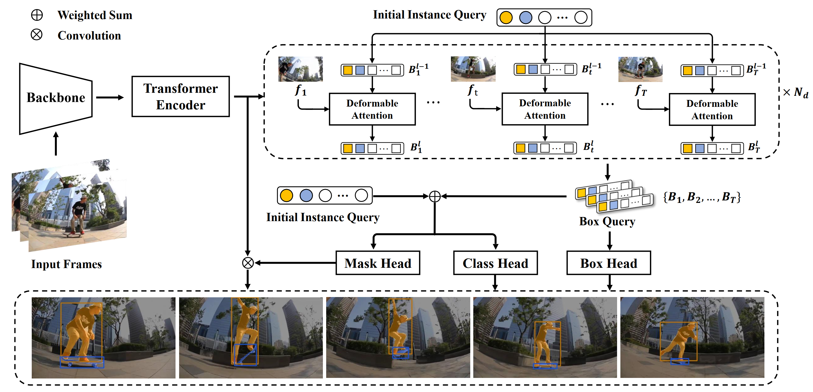

# SeqFormer: Sequential Transformer for Video Instance Segmentation


News:
SeqFormer is accepted as a paper for an oral presentation at ECCV’2022!
A revised version of the code is coming soon.


## SeqFormer

[](https://paperswithcode.com/sota/video-instance-segmentation-on-youtube-vis-1?p=seqformer-a-frustratingly-simple-model-for)


<p align="center"></p>

> [**SeqFormer: a Frustratingly Simple Model for Video Instance Segmentation**](https://arxiv.org/abs/2112.08275)
>
> Junfeng Wu, Yi Jiang, Wenqing Zhang, Xiang Bai, Song Bai
>
> [arXiv 2112.08275](https://arxiv.org/abs/2112.08275)


#### Abstract

In this work, we present SeqFormer, a frustratingly simple model for video instance segmentation. SeqFormer follows the principle of vision transformer that models instance relationships among video frames. Nevertheless, we observe that a stand-alone instance query suffices for capturing a time sequence of instances in a video, but attention mechanisms should be done with each frame independently. To achieve this, SeqFormer locates an instance in each frame and aggregates temporal information to learn a powerful representation of a video-level instance, which is used to predict the mask sequences on each frame dynamically. Instance tracking is achieved naturally without tracking branches or post-processing. On the YouTube-VIS dataset, SeqFormer achieves 47.4 AP with a ResNet-50 backbone and 49.0 AP with a ResNet-101 backbone without bells and whistles. Such achievement significantly exceeds the previous state-of-the-art performance by 4.6 and 4.4, respectively. In addition, integrated with the recently-proposed Swin transformer, SeqFormer achieves a much higher AP of 59.3. We hope SeqFormer could be a strong baseline that fosters future research in video instance segmentation, and in the meantime, advances this field with a more robust, accurate, neat model.


<p align="center"></p>


#### Visualization results on YouTube-VIS 2019 valid set

### 


### Installation

First, clone the repository locally:

```bash
git clone https://github.com/wjf5203/SeqFormer.git
```

Then, install PyTorch 1.7 and torchvision 0.8:

```bash
conda install pytorch==1.7.1 torchvision==0.8.2 torchaudio==0.7.2 -c pytorch
```

Install dependencies and pycocotools for VIS:

```bash
pip install -r requirements.txt
pip install git+https://github.com/youtubevos/cocoapi.git#"egg=pycocotools&subdirectory=PythonAPI"
```

Compiling CUDA operators:

```bash
cd ./models/ops
sh ./make.sh
# unit test (should see all checking is True)
python test.py
```


### Data Preparation

Download and extract 2019 version of YoutubeVIS train and val images with annotations from [CodeLab](https://competitions.codalab.org/competitions/20128#participate-get_data) or [YouTubeVIS](https://youtube-vos.org/dataset/vis/), and download COCO 2017 datasets. We expect the directory structure to be the following:

```
SeqFormer
├── datasets
│   ├── coco_keepfor_ytvis19.json
...
ytvis
├── train
├── val
├── annotations
│   ├── instances_train_sub.json
│   ├── instances_val_sub.json
coco
├── train2017
├── val2017
├── annotations
│   ├── instances_train2017.json
│   ├── instances_val2017.json
```


The modified coco annotations 'coco_keepfor_ytvis19.json' for joint training can be downloaded from [[google]](https://drive.google.com/file/d/1dhfxtnu0oiolNyOWjf4CscBgb_tNg-K8/view?usp=sharing).

##  


### Model zoo

#### Ablation model

Train on YouTube-VIS 2019, evaluate on YouTube-VIS 2019.

| Model                                                        | AP   | AP50 | AP75 | AR1  | AR10 |
| ------------------------------------------------------------ | ---- | ---- | ---- | ---- | ---- |
| SeqFormer_ablation [[google]](https://drive.google.com/file/d/1fI8_1h_UDaZiwOupCOa4_tRPWa49uzDr/view?usp=sharing) | 45.1 | 66.9 | 50.5 | 45.6 | 54.6 |

#### YouTube-VIS model

Train on YouTube-VIS 2019 and COCO, evaluate on YouTube-VIS 2019 val set.       

| Model                                                        | AP   | AP50 | AP75 | AR1  | AR10 | Pretrain                                                     |
| ------------------------------------------------------------ | ---- | ---- | ---- | ---- | ---- | ------------------------------------------------------------ |
| SeqFormer_r50 [[google]](https://drive.google.com/file/d/1ecKUrt9vNZscI4gaGCrvjRLu6rDM9wNX/view?usp=sharing) | 47.4 | 69.8 | 51.8 | 45.5 | 54.8 | [weight](https://drive.google.com/file/d/1aWCeak2DY5arbUzYzbsAgrUfFnVkI8qi/view?usp=sharing) |
| SeqFormer_r101 [[google]](https://drive.google.com/file/d/1bUaMVz5zITzKzqnQC8aM9Ul0KrQ6sKgn/view?usp=sharing) | 49.0 | 71.1 | 55.7 | 46.8 | 56.9 | [weight](https://drive.google.com/file/d/1dxPfPQiTFoN-hfyGvVxpmF2cwFYjeJgI/view?usp=sharing) |
| SeqFormer_x101 [[google]](https://drive.google.com/file/d/1cB9cleZWmiited6JEYVZ9P9PyfyAzy_m/view?usp=sharing) | 51.2 | 75.3 | 58.0 | 46.5 | 57.3 | [weight](https://drive.google.com/file/d/1F4Y6tGgbnK-gMG05EBlUzKDDuoX0xsw1/view?usp=sharing) |
| SeqFormer_swin_L [[google]](https://drive.google.com/file/d/1lENhEaMVhP9DylTcQFElPMVQOfKqmo0a/view?usp=sharing) | 59.3 | 82.1 | 66.4 | 51.7 | 64.4 | [weight](https://drive.google.com/file/d/19A4mgRqq6b-TTFN_ntYLQ3dQcaHYOD_p/view?usp=sharing) |


### Training

We performed the experiment on NVIDIA Tesla V100 GPU. All models of SeqFormer are trained with total batch size of 16.

To train SeqFormer on YouTube-VIS 2019 with 8 GPUs , run:

```
GPUS_PER_NODE=8 ./tools/run_dist_launch.sh 8 ./configs/r50_seqformer_ablation.sh
```


To train SeqFormer on YouTube-VIS 2019 and COCO 2017 jointly, run:

```
GPUS_PER_NODE=8 ./tools/run_dist_launch.sh 8 ./configs/r50_seqformer.sh
```


To train SeqFormer_swin_L on multiple nodes, run:

On node 1:

```
MASTER_ADDR=<IP address of node 1> NODE_RANK=0 GPUS_PER_NODE=8 ./tools/run_dist_launch.sh 16 ./configs/swin_seqformer.sh
```

On node 2:

```
MASTER_ADDR=<IP address of node 1> NODE_RANK=1 GPUS_PER_NODE=8 ./tools/run_dist_launch.sh 16 ./configs/swin_seqformer.sh
```


### Inference & Evaluation


Evaluating on YouTube-VIS 2019:

```
python3 inference.py  --masks --backbone [backbone] --model_path /path/to/model_weights --save_path results.json 
```

To get quantitative results, please zip the json file and upload to the [codalab server](https://competitions.codalab.org/competitions/20128#participate-submit_results).


## Citation

```
@article{wu2021seqformer,
      title={SeqFormer: a Frustratingly Simple Model for Video Instance Segmentation}, 
      author={Junfeng Wu and Yi Jiang and Wenqing Zhang and Xiang Bai and Song Bai},
      journal={arXiv preprint arXiv:2112.08275},
      year={2021},
}
```

## Acknowledgement

This repo is based on [Deformable DETR](https://github.com/fundamentalvision/Deformable-DETR) and [VisTR](https://github.com/Epiphqny/VisTR). Thanks for their wonderful works.
